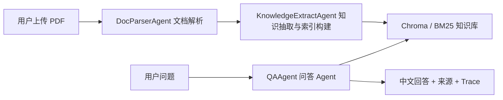
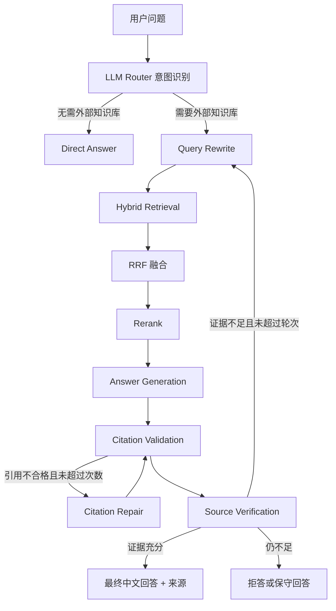

# 基于 Agentic RAG 的海洋矿产科研文献智能问答系统

这是一个面向海洋矿产与深海科研论文的智能问答 Agent 项目。系统支持 PDF 文献解析、文本清洗、父子文档切片、混合检索、Rerank、LLM Router、答案生成、来源追溯、引用校验、证据充分性判断、低置信度重检索、上下文记忆、Trace Debug、用户反馈闭环、FastAPI 服务化、React 可视化前端和离线评测。

项目适合用于海洋矿产、深海多金属结核、富钴结壳、热液硫化物、地球化学指标、矿物识别和科研文献阅读场景。

## 技术栈

- Python
- LangChain / LangGraph
- FastAPI
- React
- MinerU
- Chroma 向量数据库 / numpy 兜底检索
- BM25 关键词检索
- RRF 混合检索融合
- 双分支 Rerank：轻量 CrossEncoder / BGE Reranker / 规则兜底
- SQLite 上下文记忆与反馈存储

## 核心功能

- PDF 文献入库：支持科研 PDF 上传、解析、清洗、切片和索引构建。
- 多模态解析：支持文本、表格、图片、图注和公式等内容抽取。
- 语义级图片理解：MinerU 抽取图片资产后，可调用视觉模型生成中文摘要并作为图片证据入库。
- 父子文档切片：小块用于精准检索，大块用于保留回答上下文。
- 混合检索：向量语义检索 + BM25 关键词检索，并使用 RRF 进行结果融合。
- Rerank 重排：支持轻量 CrossEncoder 和 BGE `bge-reranker-v2-m3` 双分支，缺失依赖时降级为领域词和 query overlap 规则重排。
- LLM Router：由大模型判断问题是否需要调用外部论文知识库。
- Query Rewrite：对专业问题和追问问题进行查询改写，提高召回率。
- Source Verification：判断检索证据是否足够支撑回答。
- Citation Validator：校验回答中的引用编号、来源文档和页码是否真实来自检索证据。
- 低置信度重检索：证据不足时进入 query rewrite 后再次检索，默认最多 2 轮。
- 上下文记忆：支持短期滑动窗口记忆、摘要记忆和显式长期记忆。
- Trace Debug：记录每个 Agent 节点的输入、输出、耗时和关键决策。
- 反馈闭环：支持用户点赞、点踩、纠错和人工审核，负反馈可进入评测坏例集。
- FastAPI 服务化：提供文档上传、索引构建、问答、记忆、反馈和 trace 查询接口。
- 多 Agent 编排：拆分为 DocParserAgent、KnowledgeExtractAgent 和 QAAgent，不包含增量更新 Agent。
- 离线评测：支持 Hit@K、MRR、Citation Accuracy、Faithfulness、Refusal Accuracy 等指标。

## 多 Agent 架构

项目采用 3 个 Agent 分工，不启用增量更新 Agent：



- DocParserAgent：负责调用 MinerU，完成 PDF 版面解析、OCR、表格/公式/图片/图注抽取和图片中文语义摘要。
- KnowledgeExtractAgent：负责结构化证据清洗、父子文档切片、Embedding、Chroma 向量入库和 BM25 关键词索引构建。
- QAAgent：负责调用内部 LangGraph Agentic RAG 流程，完成 LLM Router、Query Rewrite、混合检索、Rerank、答案生成、引用校验、证据验证和记忆写入。

没有加入 KnowledgeUpdateAgent，因为当前项目定位是实习简历中的科研 PDF 问答系统，知识库更新采用“上传文档后重建索引”的方式，更容易保证来源一致性和可追溯性。

## Agent 工作流



## 检索流程

系统使用混合检索，而不是单纯向量检索：

1. 向量检索：通过 Chroma 存储 embedding，并召回语义相近的子文档块。
2. BM25 检索：通过关键词匹配召回专业术语、矿物名称、元素符号和地名等精确词。
3. RRF 融合：融合向量检索和关键词检索的排名。
4. 父文档回填：命中子块后回填父文档上下文。
5. Rerank：对候选证据重新排序，选择最相关的片段进入生成节点。

兼顾语义召回和术语精确匹配，适合科研论文中大量专有名词、英文术语、元素符号和表格数据并存的场景。


## 上下文记忆

项目使用分层记忆机制：

- 短期记忆：保存最近若干轮通过校验的对话，用于处理追问。
- 摘要记忆：当短期窗口超出限制时，将旧对话压缩成摘要。
- 长期记忆：保存用户显式写入的稳定偏好、背景信息或长期约束。

记忆只用于理解问题和补全上下文，不能替代论文证据。RAG 回答只有同时通过 Source Verification 和 Citation Validator 后，才会写入 Agent 记忆。

## PDF 解析

默认解析后端是 MinerU：

```env
PARSER_BACKEND=mineru
PARSER_FALLBACK=false
MINERU_BACKEND=pipeline
MINERU_METHOD=auto
```

MinerU 适合处理科研论文中的复杂版面、表格、公式、图片、图注和图文混排内容。系统会优先读取 MinerU 导出的结构化 JSON 或 Markdown，并将文本块、表格块、图片块和图注统一转换为可检索证据。

项目已取消 PyMuPDF 兜底解析。如果 MinerU 不可用，入库会直接失败并提示安装或配置 MinerU，避免不同解析器造成文档结构不一致。

```env
MINERU_METHOD=ocr
```

如果 PDF 是扫描件或图片型论文，可以把 `MINERU_METHOD` 设置为 `ocr`。OCR 在文档入库阶段自动执行，不需要人工逐页操作。

如果配置支持视觉输入的 OpenAI-compatible API，MinerU 抽取到的图片会生成中文语义摘要后进入检索系统，用于支持多模态问答。这个步骤位于“PDF 解析 -> 结构化块转换 -> 多模态图片摘要 -> 父子切片 -> Chroma/BM25 入库”之间。

## 前端运行

项目已使用 React 替换 Streamlit。React 静态前端由 FastAPI 直接托管，不需要 npm 构建步骤：

```powershell
.\run_api.ps1
```

访问：

```text
http://127.0.0.1:8000
```

如果 8000 端口已被其他服务占用，启动脚本会自动切换到：

```text
http://127.0.0.1:8001
```

也可以运行：

```powershell
.\run.ps1
```

React 前端支持 PDF 上传、索引构建、中文问答、来源证据、Agent 执行轨迹、记忆查看和反馈提交。

## 大模型配置

项目的大模型层采用 OpenAI-compatible API 封装，不强绑定某个厂商模型。

未配置 API Key 时，系统会降级到规则 Router、抽取式回答和规则校验，保证基础流程可运行。

## 向量数据库

项目默认使用 Chroma 作为向量数据库：

```env
VECTOR_BACKEND=chroma
```

入库时，系统会先对父子切片后的子文档生成 embedding，再写入 Chroma collection；检索时优先通过 Chroma 做语义召回，然后与 BM25 关键词检索结果进行 RRF 融合。如果本地没有安装 `chromadb` 或 Chroma 初始化失败，系统会自动回退到 numpy 向量检索，保证 Demo 不会因为依赖问题无法运行。

配置 OpenAI：

```env
OPENAI_API_KEY=你的 key
OPENAI_BASE_URL=
OPENAI_MODEL=gpt-4o-mini
VISION_MODEL=gpt-4o-mini
```

配置阿里百炼、OceanGPT 或其他兼容 OpenAI 接口的服务：

```env
LLM_BACKEND=openai-compatible
CUSTOM_LLM_API_KEY=你的 key
CUSTOM_LLM_BASE_URL=https://你的服务地址/v1
CUSTOM_LLM_MODEL=你的模型名
```

回答会被提示词约束为中文，即使上传的是英文 PDF，也会用中文作答。


主要接口：

- `POST /documents/upload`：上传 PDF 并构建索引
- `POST /chat`：Agentic RAG 问答
- `GET /memory/{session_id}`：查询会话记忆
- `DELETE /memory/{session_id}`：清空会话记忆
- `POST /memory/long-term`：写入长期记忆
- `GET /traces`：查询 Trace 列表
- `GET /traces/{trace_id}`：查询单次调用的完整 Trace
- `POST /feedback`：提交用户反馈
- `GET /feedback`：查看反馈队列
- `POST /feedback/{feedback_id}/review`：审核反馈

## 评测

示例评测集位于：

```text
evaluation/sample_eval.jsonl
```

运行评测：

```powershell
python tools/evaluate.py --dataset evaluation/sample_eval.jsonl
```

支持的指标包括：

- Hit@K：正确证据是否出现在 top-k 检索结果中
- MRR：正确证据在检索结果中的排名质量
- Citation Accuracy：答案引用是否对应真实 source/page
- Faithfulness：答案是否忠实于检索证据
- Refusal Accuracy：证据不足时是否正确拒答
- Answer Term Recall：答案是否覆盖关键术语
- LLM-as-a-Judge：可选的大模型自动评分

## 项目结构

```text
frontend/               React 可视化问答界面
src/agent.py            LangGraph Agentic RAG 主流程
src/api.py              FastAPI 服务
src/pdf_ingest.py       PDF 入库统一入口
src/mineru_ingest.py    MinerU 解析后端
src/multimodal.py       多模态证据抽取与视觉摘要
src/text_processing.py  文本清洗与切片
src/parent_child.py     父子文档切片
src/vector_store.py     Chroma 向量检索、BM25、RRF 混合检索
src/rerank.py           CrossEncoder / BGE / 规则兜底重排
src/llm.py              大模型调用、Router、生成与校验
src/citation.py         引用校验
src/memory.py           短期、摘要和长期记忆
src/feedback.py         用户反馈闭环
src/observability.py    Trace Debug
tools/evaluate.py       离线评测脚本
tests/                  单元测试
docs/                   设计说明文档
```

## 安全说明

仓库不会提交以下本地运行产物：

```text
.env
.venv/
data/index/
data/uploads/
data/traces/
data/*.db
data/logs/
evaluation/feedback_bad_cases.jsonl
```

请不要把真实 API Key、论文原文数据、本地索引、数据库或用户反馈数据上传到公开仓库。
